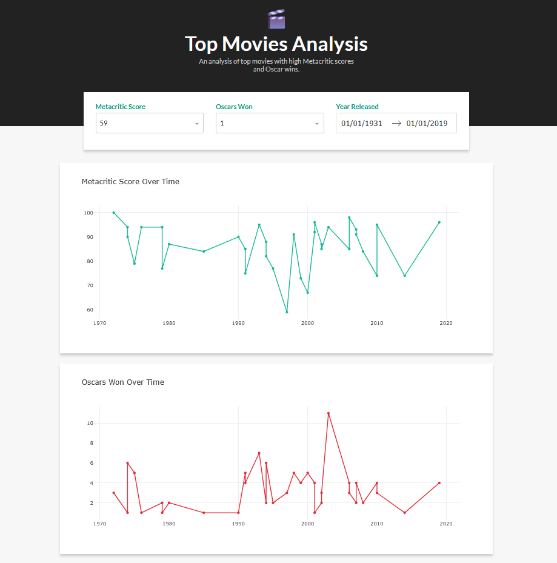

# Dash Data Interface
A web dashboard interface (built with Dash) to display and interact with movie data.  
This project provides tools to visualize, filter, and explore movie datasets via a simple, user-friendly web app.

---

## Features
- Interactive dashboard built with Dash (Plotly)  
- Filter, sort, and explore top movie data  
- Visualizations (charts, tables)  
- Responsive layout  
- Easily extendable for additional data sources or plots  

---

## Screenshots

---