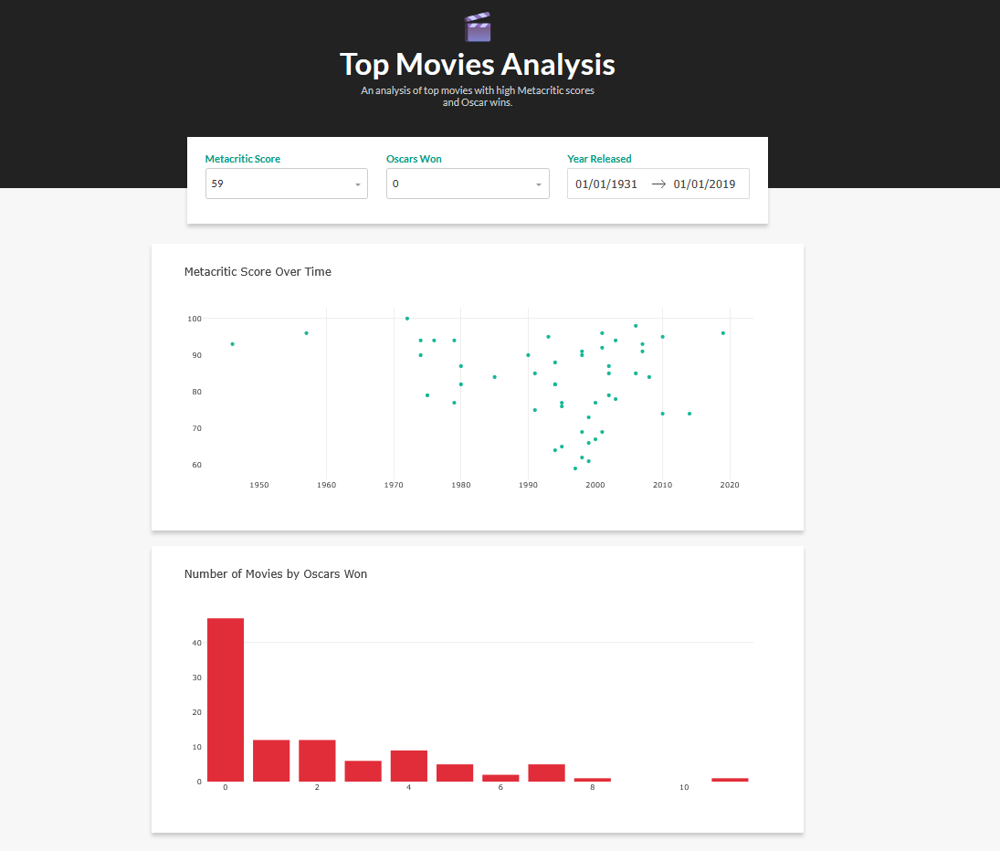

# Dash Data Interface
A web dashboard interface (built with Dash) to display and interact with movie data.  
This project provides tools to visualize, filter, and explore movie datasets via a simple, user-friendly web app.

---

## Features
- Interactive dashboard built with Dash (Plotly)  
- Filter, sort, and explore top movie data  
- Visualizations (charts, tables)  
- Responsive layout  
- Easily extendable for additional data sources or plots
- Managed with **uv** for fast dependency installation and reproducible environments    

---

## Screenshots


---

### Prerequisites

- **Python 3.8+**
- **uv** installed  
  If you don’t have `uv`, install it with:

  ```bash
  pip install uv

### Installation

1. Clone the repository:

   ```bash
   git clone https://github.com/Dvdandrades/Dash_Data_Interface.git
   cd Dash_Data_Interface

2. Install dependencies with uv
    ```bash
    uv sync

3. Running locally
    ```bash
    uv run app.py